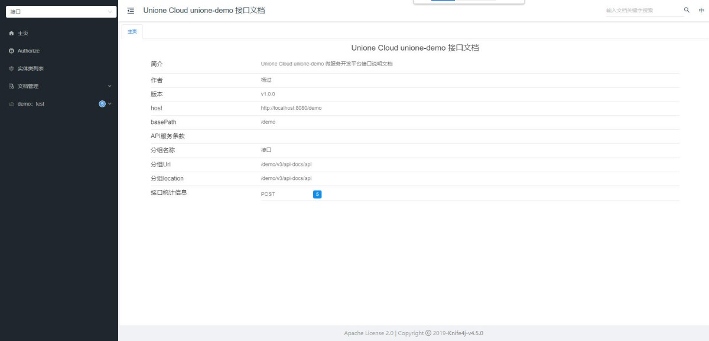
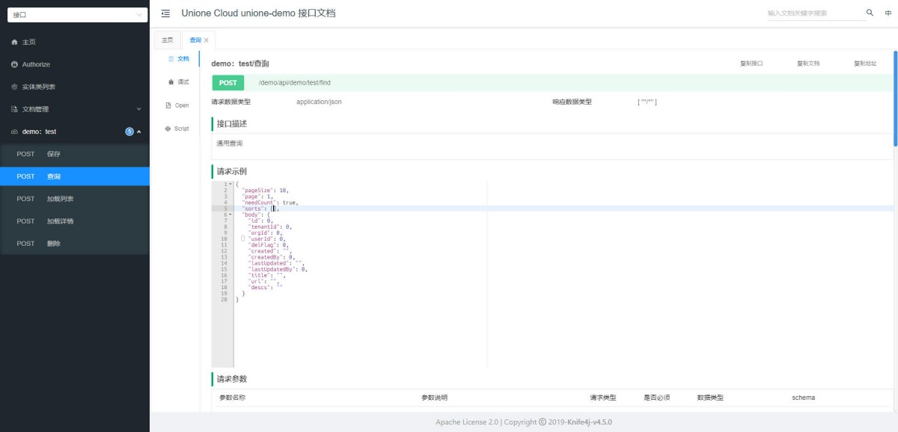

# 开发指南

## 1. 开发步骤

### 1.1 创建maven项目

- 创建新的maven项目
- 配置项目依赖，包括unione-web依赖
```xml
<dependency>
    <groupId>cloud.unione</groupId>
    <artifactId>unione-web</artifactId>
    <version>${unione.version}</version>
</dependency>
```
最简项目pom模版：
```xml
<?xml version="1.0" encoding="UTF-8"?>
<project xmlns="http://maven.apache.org/POM/4.0.0"
         xmlns:xsi="http://www.w3.org/2001/XMLSchema-instance"
         xsi:schemaLocation="http://maven.apache.org/POM/4.0.0 http://maven.apache.org/xsd/maven-4.0.0.xsd">
    <modelVersion>4.0.0</modelVersion>
	<parent>
		<groupId>cloud.unione</groupId>
		<artifactId>unione</artifactId>
		<version>${unione.version}</version>
	</parent>
	<artifactId>xxx</artifactId>
	<properties>
		<unione-version>1.0.0-SNAPSHOT</unione-version>
	</properties>
	<dependencies>
		<dependency>
			<groupId>cloud.unione</groupId>
			<artifactId>unione-web</artifactId>
			<version>${unione.version}</version>
		</dependency>
		<dependency>
			<groupId>org.projectlombok</groupId>
			<artifactId>lombok</artifactId>
			<version>${lombok.version}</version>
			<scope>provided</scope>
		</dependency>
	</dependencies>
	<build>
		<plugins>
			<plugin>
				<groupId>org.apache.maven.plugins</groupId>
				<artifactId>maven-compiler-plugin</artifactId>
				<configuration>
					<annotationProcessorPaths>
						<path>
							<groupId>org.projectlombok</groupId>
							<artifactId>lombok</artifactId>
							<version>${lombok.version}</version>
						</path>
					</annotationProcessorPaths>
				</configuration>
			</plugin>
	</build>
</project>
```
项目模版,点击下载：[unione-demo项目模版](./file/unione-demo.zip)


### 1.2 导入数据库
- 导入数据库初始化脚本
    ```bash
    # Linux/Mac
    mysql -u root -p unione < db/mysql/unione-init.sql
    
    # Windows
    mysql -u root -p unione < db\mysql\unione-init.sql
    ```


### 1.3 修改配置
编辑配置文件（bootstrap-*.yml）
修改数据库连接信息：
```yaml
spring:
  datasource:
    url: jdbc:mysql://localhost:3306/unione?useUnicode=true&characterEncoding=utf8&serverTimezone=Asia/Shanghai
    username: unione
    password: yourpassword  # 修改为你的数据库密码
    driver-class-name: com.mysql.cj.jdbc.Driver
```

修改Redis连接信息：
```yaml
spring:
  redis:
    host: localhost
    port: 6379
    password:  # 如果有密码请填写
    database: 0
```

### 1.3 启动服务
- 启动unione-demo服务
- 访问`http://localhost:8080/demo/doc.html`验证服务是否启动成功
- 图片1:

- 图片2:



## 1.4. 接口开发
项目完成数据库设计后，根据数据库表结构使用代码生成器生成实体类、和Controller层的基础代码。
- 代码生成：
    1. 配置代码生成参数
    2. 选择要生成的表
    3. 运行代码生成器
    4. 将生成的代码复制到相应模块
- 代码调试：根据业务需求微调代码，启动服务使用doc文档在线调试

### 1.4.1 代码生成配置
```java
	private static   DataSource datasource() {
		HikariDataSource ds = new HikariDataSource();
		ds.setJdbcUrl("jdbc:mysql://127.0.0.1:3306/unione?serverTimezone=Asia/Shanghai&autoReconnect=true&useUnicode=true&characterEncoding=utf8");
		ds.setUsername("unione");
		ds.setPassword("unione@db");
		ds.setDriverClassName("com.mysql.cj.jdbc.Driver");
		return ds;
	}
	public static void main(String[] args) {

		String modelName="demo";
		String packageName="com.unione.cloud";
		
		BuilderFactory factory = build(modelName);
		SimpleUnioneProject mavenProject = new SimpleUnioneProject(packageName);
		mavenProject.setRoot("d://codegen_"+DateUtil.format(new Date(), "yyyyMMdd-HHmmss"));

		factory.gen("demo_test",mavenProject);
//		factory.genAll(mavenProject);
	}
```
### 1.4.2 实体对象
```java
@Data
@Builder
@SqlResource("demo.DemoTest")
@NoArgsConstructor
@AllArgsConstructor
@Accessors(chain = true)
@Table(name="demo_test")
public class DemoTest extends Pojo {
	/**
	* 标题
	*/
	@KeyWords
	@Schema(title="标题",description="长度为：50")
	private String title;
	/**
	* URL
	*/
	@Schema(title="URL",description="长度为：250")
	private String url;
	/**
	* 描述
	*/
	@KeyWords
	@Schema(title="描述",description="长度为：500")
	private String descs;
}
```

### 1.4.3 接口定义
```java
@Slf4j
@RestController
@Tag(name = "demo：test",description="DemoTest")
@RequestMapping("/api/demo/test")	 //TreeFeignApi
public class DemoTestController implements PojoFeignApi<DemoTest>{
	@Autowired
	private DataBaseDao dataBaseDao;
	
	@Override
	@Action(title="查询demo:测试接口",type = ActionType.Query)
	public Results<List<DemoTest>> find(Params<DemoTest> params) {
		AssertUtil.service().notNull(params.getBody(),"请求参数body不能为空");
		Results<List<DemoTest>> results = dataBaseDao.findPages(SqlBuilder.build(params));
		LogsUtil.add("分页数据统计，数据总量count:"+results.getTotal());
		LogsUtil.add("分页数据查询，记录数量size:"+results.getBody().size());
		
		return results;
	}

	@Override
	@Action(title="保存demo:测试接口",type = ActionType.Save)
	public Results<Long> save(@Validated(Validator.save.class) DemoTest entity) {
		// 参数处理
		int len = 0;
		if(entity.getId()==null) {
			len = dataBaseDao.insert(entity);
		}else {
			String[] fields = {"orgId","userId","title","url","descs"};
			SqlBuilder<DemoTest> sqlBuilder=SqlBuilder.build(entity).field(fields);
		 	len = dataBaseDao.updateById(sqlBuilder);
		}
		return Results.build(len>0, entity.getId());
	}

	@Override
	@Action(title="加载demo:测试接口列表",type = ActionType.Query,nolog = true)
	public Results<List<DemoTest>> findByIds(Set<Long> ids) {
		// 参数处理
		AssertUtil.service().isTrue(!ids.isEmpty(), "参数ids不能为空");
		
		List<DemoTest> rows = dataBaseDao.findByIds(SqlBuilder.build(DemoTest.class,new ArrayList<>(ids)));
		LogsUtil.add("批量查询数据:"+rows.size());
		
		return Results.success(rows);
	}

	@Override
	@Action(title="加载demo:测试接口详情",type = ActionType.Query,nolog = true)
	public Results<DemoTest> detail(Long id) {
		// 参数处理
		AssertUtil.service().notNull(id,"参数id不能为空");
		DemoTest tmp = dataBaseDao.findById(SqlBuilder.build(DemoTest.class,id));
		AssertUtil.service().notNull(tmp, "记录未找到");
		
		return Results.success(tmp);
	}

	@Override
	@Action(title="删除demo:测试接口",type = ActionType.Delete)
	public Results<Integer> delete(Set<Long> ids){
		Results<Integer> results = new Results<>();
		// 参数处理
		AssertUtil.service().isTrue(!ids.isEmpty(), "参数ids不能为空");
		
		// 执行删除
		LogsUtil.add("删除数ids:"+JSONUtil.toJsonStr(ids));
		int count = dataBaseDao.deleteById(SqlBuilder.build(DemoTest.class,ids));
		LogsUtil.add("成功删除记录数量:"+count);
		
		results.setSuccess(count>0);
		results.setMessage(count>0?"操作成功":"操作失败");
		results.setBody(count);

		return results;
	}
//	@Override
//  @Action(title="加载demo:测试接口子级",type = ActionType.Query,nolog = true)
//	public Results<List<DemoTest>> children(Long pid){
//		 //参数处理
//		AssertUtil.service().notNull(pid, "参数pid不能为空");
//		// 执行查询
//		DemoTest params = new DemoTest();
//		params.setParentId(pid);
//		List<DemoTest> rows = dataBaseDao.findList(SqlBuilder.build(params));
//		return Results.success(rows);
//	}
}
```
默认生成的Controller包含了标准的CRUD操作接口，包括查询、保存、删除、批量查询和详情查询。如果该实体类有父级关系，则切换父接口为TreeFeignApi并解开children方法注释。

## 1.5 数据查询
- 引入DataBaseDao，通过DataBaseDao进行数据库操作
- DataBaseDao支持丰富的查询方法，包括分页查询、条件查询、排序查询等。
- 可以使用SqlBuilder构建复杂的动态查询条件，支持多表关联查询，子查询等。
```java
	@Override
	@Action(title="查询demo:测试接口",type = ActionType.Query)
	public Results<List<DemoTest>> find(Params<DemoTest> params) {
		AssertUtil.service().notNull(params.getBody(),"请求参数body不能为空");
		Results<List<DemoTest>> results = dataBaseDao.findPages(SqlBuilder.build(params));
		LogsUtil.add("分页数据统计，数据总量count:"+results.getTotal());
		LogsUtil.add("分页数据查询，记录数量size:"+results.getBody().size());
		return results;
	}
```
- 关键字查询：通过在实体字段添加@KeyWords注解，自动进行模糊查询。
```java
public class DemoTest extends Pojo {
	@KeyWords
	@Schema(title="标题",description="长度为：50")
	private String title;
	@Schema(title="URL",description="长度为：250")
	private String url;
	@KeyWords
	@Schema(title="描述",description="长度为：500")
	private String descs;
}
```
- 指定查询字段：通过SqlBuilder的field方法指定要查询的字段，避免查询所有字段。
```java
	@Override
	@Action(title="查询demo:测试接口",type = ActionType.Query)
	public Results<List<DemoTest>> find(Params<DemoTest> params) {
		AssertUtil.service().notNull(params.getBody(),"请求参数body不能为空");
		Results<List<DemoTest>> results = dataBaseDao.findPages(SqlBuilder.build(params).field("id,title,url"));
		LogsUtil.add("分页数据统计，数据总量count:"+results.getTotal());
		LogsUtil.add("分页数据查询，记录数量size:"+results.getBody().size());
		return results;
	}
```
- 条件查询：通过SqlBuilder的where方法添加查询条件，支持等于、不等于、大于、小于、like等操作。
```java
	@Override
	@Action(title="查询demo:测试接口",type = ActionType.Query)
	public Results<List<DemoTest>> find(Params<DemoTest> params) {
		AssertUtil.service().notNull(params.getBody(),"请求参数body不能为空");
		Results<List<DemoTest>> results = dataBaseDao.findPages(SqlBuilder.build(params).where("url like [%?%]"));
		LogsUtil.add("分页数据统计，数据总量count:"+results.getTotal());
		LogsUtil.add("分页数据查询，记录数量size:"+results.getBody().size());
		return results;
	}
```
- 连接查询：通过SqlBuilder的link方法添加连接查询。
- 排序查询：通过SqlBuilder的orderBy方法指定排序字段和排序方向。


## 1.6 事务管理
- 使用Spring的声明式事务
- 在Service层添加`@Transactional`注解
- 合理设置事务的传播行为和隔离级别

## 1.7 数据安全

- 敏感数据加密存储
- 防SQL注入
- 防XSS攻击
- 防CSRF攻击

## 1.8 日志记录

- 记录关键操作日志
- 不记录敏感信息
- 日志格式统一


## 1.9 性能优化建议

### 1.9.1 数据库优化

- 合理设计索引
- 优化SQL查询
- 使用分页查询
- 避免N+1查询问题

### 1.9.2 缓存使用

- 使用Redis缓存热点数据
- 设置合理的缓存过期时间
- 实现缓存预热和缓存更新策略
- 缓存空值处理
- 缓存击穿保护
【推荐使用jetcache】


### 1.9.3 代码优化

- 避免循环中进行数据库操作
- 使用线程池处理并发任务
- 减少不必要的对象创建
- 使用合适的集合类型